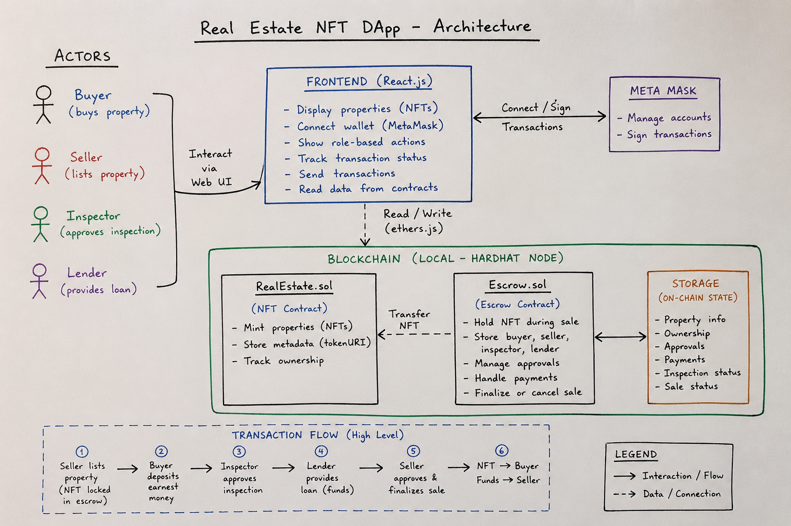

# Real Estate NFT DApp

📌 **Project Overview**  
This project is a simple **decentralized application (dApp)** that simulates a real estate transaction using blockchain technology.  
Each property is represented as an **NFT (ERC-721 token)**, and the buying process is handled through an **Escrow smart contract** that enforces a structured workflow between multiple participants.  

The goal of this project is to demonstrate:

- Interaction between a frontend (React) and smart contracts  
- Basic escrow logic on blockchain  
- Multi-actor transaction flow **(buyer, seller, inspector, lender)**  

⚠️ **Note:** This is a learning/demo project, not a production-ready system.

## 🏗️ Architecture Overview

The system is composed of three main layers:

1. **Frontend (React)**  
        - Displays available properties (NFTs)  
        - Allows users to interact with the system (buy, approve, inspect, lend)  
        - Connects to MetaMask for wallet interaction  
2. **Blockchain Layer (Smart Contracts)**  
        - Handles all business logic (ownership, approvals, payments)  
        - Stores state (who approved, who owns, etc.)  
3. **Local Blockchain (Hardhat)**  
        - Simulates Ethereum network locally  
        - Provides test accounts and ETH for development  

## 👥 Actors in the System

**The system models four roles:**

- **Buyer**  
        - Selects a property  
        - Deposits earnest money (initial payment)  
        - Approves the purchase  
- **Seller**  
        - Lists the property  
        - Approves the sale  
- **Inspector**  
        - Verifies the property condition  
        - Approves or rejects inspection  
- **Lender**  
        - Provides remaining funds (loan)  
        - Approves the transaction  

⚠️ In this project, these roles are predefined addresses (from Hardhat accounts), not dynamically assigned.

## 📜 Smart Contracts

### 1. RealEstate.sol
A basic NFT contract representing properties.  
**Responsibilities:**
- Mint NFTs (each NFT = one property)
- Store metadata (via tokenURI)
- Track total supply

**Key Functions:**
- `mint(tokenURI)` → creates a new property NFT
- `totalSupply()` → returns number of properties
- `tokenURI(id)` → returns metadata URL

### 2. Escrow.sol
Handles the property sale process.  
**Responsibilities:**
- Holds NFT during sale
- Stores buyer, seller, inspector, lender
- Manages approvals and payments
- Finalizes or cancels sale

**Key Features:**

**Listing**
- Transfers NFT from seller to escrow contract
- Stores buyer, price, and deposit amount

**Deposit Earnest**
- Buyer sends initial ETH deposit

**Inspection**
- Inspector approves/rejects property

**Approval System**
- Buyer, seller, lender must approve

**Finalization**
- Transfers ETH to seller
- Transfers NFT to buyer

**Cancellation**
- Refunds based on inspection result

## 🔄 Transaction Flow

1. Seller lists property → NFT moved to escrow
2. Buyer deposits earnest money
3. Inspector approves property
4. Lender provides remaining funds
5. Seller approves and finalizes sale
6. NFT → Buyer, ETH → Seller

## 💻 Frontend ↔ Blockchain Interaction

The frontend communicates with smart contracts using Ethers.js.

**Steps:**

1. **Connect to MetaMask:**
   ```js
   const provider = new ethers.providers.Web3Provider(window.ethereum);
   ```
2. **Load deployed contracts:**
   ```js
   const contract = new ethers.Contract(address, ABI, provider);
   ```
3. **Read data:**
   ```js
   await contract.totalSupply();
   ```
4. **Write transactions (via signer):**
    ```js
   const signer = provider.getSigner(); 
   await contract.connect(signer).depositEarnest(id, { value });
   ```
## 🖥️ Frontend Logic

### App.js
- Loads blockchain data
- Fetches NFT metadata
- Displays property cards
- Handles account changes

### Home.js
- Displays property details
- Shows role-based actions:
  - Buyer → Buy
  - Inspector → Approve inspection
  - Lender → Approve & fund
  - Seller → Finalize sale
- Tracks transaction state (approved, inspected, etc.)

## 🛠️ Technology Stack

- **Solidity** → Smart contracts
- **Hardhat** → Development & testing
- **Ethers.js** → Blockchain interaction
- **React.js** → Frontend UI
- **JavaScript** → Application logic

## ⚙️ Setup & Installation

### Requirements
- Node.js
- MetaMask browser extension

### Steps

1. **Clone the Repository**
   ```bash
   git clone https://github.com/Melek-73/Blockchain-dApps
   cd Blockchain-dApps
   ```
2. **Install Dependencies**
    ```bash
    npm install
    ```
3. **Run Tests**
    ```bash
    npx hardhat test
    ```
4. **Start Local Blockchain**
    ```bash
    npx hardhat node
    ```
5. **Deploy Contracts** , open  a new terminal:
    ```bash
    npx hardhat run ./scripts/deploy.js --network localhost
    ```
6. **Start Frontend**
    ```bash
    npm run start
    ```
## 🧪 Testing the Application

- Import the Hardhat test accounts into MetaMask

- Switch between the following roles:

  - **Account 0** → Buyer
  - **Account 1** → Seller
  - **Account 2** → Inspector
  - **Account 3** → Lender

### Test the Full Escrow Flow:

1. Buyer deposits earnest money
2. Inspector approves the inspection
3. Lender funds the remaining amount
4. Seller finalizes the sale

## ⚠️ Limitations

This project includes several simplifications for educational purposes:

- Roles are hardcoded (not dynamic)
- No real identity verification
- No deadlines or penalties
- No per-property fund tracking (uses contract-wide balance)
- Runs only on local blockchain (not deployed to **testnet or mainnet**)

## 🎯 Purpose of the Project

This project demonstrates:

- Basic smart contract design
- dApp architecture and structure
- Frontend to blockchain interaction using ethers.js
- Multi-step escrow transaction flow involving multiple parties

**Note:** It is intended as a learning project, not a production-ready application.

## 📌 Conclusion

This dApp illustrates how blockchain technology can be applied to real estate transactions by:

- Representing properties as NFTs
- Automating transactions through smart contracts
- Coordinating multiple parties (Buyer, Seller, Inspector, Lender) without traditional intermediaries

While simplified, it provides a strong foundation for building more advanced decentralized real estate systems.